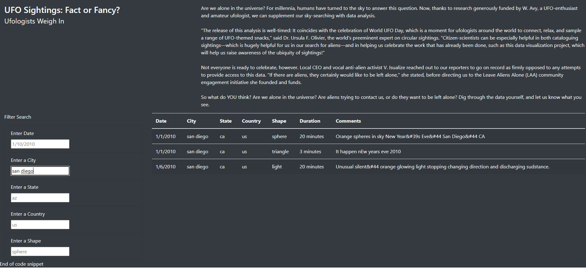

# UFOs

## Project Overview
By adding Javascript filters to an existing dataset, a data journalist can fine tune the results and display them on a web host. The following filters are added to the exiting dataset:
1. City
2. State
3. Country
4. Shape
5. Date

### Resources
+ **Languages:** JavaScript, HTML, CSS
+ **Editor Tool:** Visual Studio Code
+ **Data source:** [data.js](https://github.com/Adriangp27/UFOs/blob/main/static/js/data.js)
+ **Scripts:**
	+ [index.html](https://github.com/Adriangp27/UFOs/blob/main/index.html) 
	+ [app.js](https://github.com/Adriangp27/UFOs/blob/main/static/js/app.js)
	+ [style.css](https://github.com/Adriangp27/UFOs/blob/main/static/css/style.css)

## Results
Users will find the title and description at the top of the website when entering it.

After scrolling down the page, a specific filter search box can be seen. There are multiple filter types available depending on the user's preferences. Filters maybe set using the following criteria: Date. City, State, Country, Shape. Once the filters are set up, there will be no button to press.

## Summary
With the current filters, users can now filter only the necessary information based on the criteria that they provide. Even though the current webpage is acceptible, the dataset is very limited. It is possible to mitigate this limitation by setting up a database so that the dataset can easily be expanded by the web content creator without having manually do so. User's should be able to input data, provided that only select users can do so and that inputs must be approved first. Additionally, you can add a map with location tickers to show where the reports are coming from. The map can also be updated using the filters that are currently utilized.

